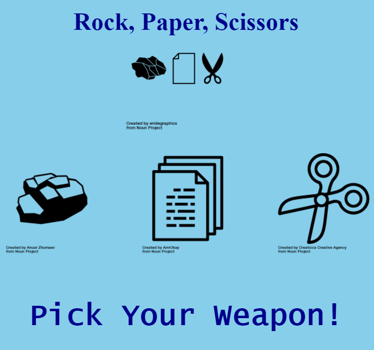

# Rock, Paper, Scissor 

Classic rock, paper, scissor game created with HTML, CSS and JavaScript

Click [here](https://jbri91.github.io/rock_paper_scissor/) if you have what it takes to defeat the computer!

# Summary
This project made a lot of things click for me. I was having a hard time understanding the dot syntax as well as working with the DOM. Because of that, I was actually able to complete this project a little faster than expected. Speed is definitely not the goal as much as quality is for me but it was a great feeling to have the ah ha moments trickling in.

As I became more familiar with creating if/else statements, I wanted to play around with the font color to change in different circumstances. This project also let me practice grabbing elements from the DOM to change them.

# Author
* Johnny Redry Briones Jr. - *Programmer*

